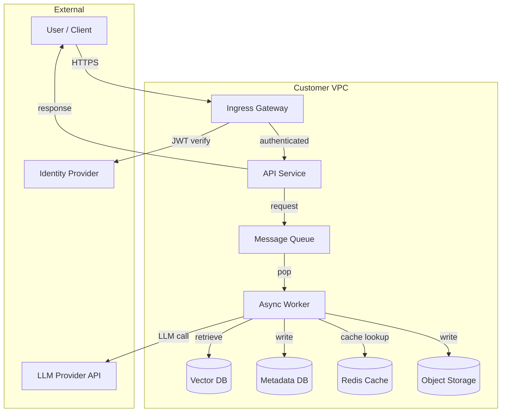

# Deployment Architecture Document — Template

**Purpose**: Customer-facing architecture document for the deployment. Lives in the handover package. Updated at each major phase (pilot → production → first major evolution).

---

## 1. System Overview

**System name**: [name]
**Version**: [semver]
**Document version**: [vX.Y]
**Last updated**: [date]
**Owners**: customer engineering team; vendor advisory

### One-paragraph summary

[What the system does, in plain language, for an engineering audience.]

### Stakeholders

- Exec sponsor: [name, role]
- Product owner: [name, role]
- Engineering owner: [name, role]
- Security contact: [name, role]

## 2. Architecture Diagram

## 3. Component Inventory

| Component | Technology | Version | Deployment | Ownership |
|-----------|------------|---------|------------|-----------|
| Ingress Gateway | Traefik | 3.0 | K8s Deployment | Customer DevOps |
| API Service | FastAPI (Python 3.11) | v1.2.0 | K8s Deployment | Customer Eng |
| Async Worker | Python | v1.2.0 | K8s Deployment (HPA enabled) | Customer Eng |
| Message Queue | RabbitMQ | 3.12 | K8s StatefulSet | Customer DevOps |
| Vector DB | Qdrant | 1.8 | K8s StatefulSet with PV | Customer DevOps |
| Metadata DB | PostgreSQL 15 | 15.4 | RDS | Customer DBA |
| Redis Cache | Redis | 7.2 | ElastiCache | Customer DBA |
| Object Storage | S3 | n/a | AWS | Customer DevOps |
| LLM Provider | Claude (Anthropic) | claude-sonnet-4-20250514 | External | Vendor (fallback: OpenAI) |

## 4. Data Flow

### 4.1 Primary request flow

1. User submits request via UI.
2. UI calls API Service via HTTPS through Ingress Gateway.
3. Ingress Gateway verifies JWT with IdP (OIDC flow).
4. API Service validates request shape, enqueues work item.
5. Async Worker dequeues, retrieves relevant context from Vector DB.
6. Worker checks Redis Cache for identical prior request (hit rate ~35%).
7. On cache miss, Worker calls LLM Provider with context + query.
8. LLM response parsed, validated, stored in Metadata DB.
9. Output stored in Object Storage for audit.
10. Worker notifies API Service (pub/sub).
11. API Service delivers response to UI.

### 4.2 Batch / scheduled flow

[Describe any batch jobs or scheduled work. Often overlooked.]

## 5. Data Model

### 5.1 Data at rest

| Dataset | Storage | Encryption | Retention |
|---------|---------|-----------|-----------|
| User sessions | Redis Cache | AES-256 (managed by ElastiCache) | 8 hours |
| Request metadata | PostgreSQL | AES-256 (managed by RDS) | 7 years (compliance) |
| LLM responses | Object Storage | SSE-KMS | 7 years |
| Audit logs | Object Storage with Object Lock | SSE-KMS | 7 years |
| Vector embeddings | Qdrant storage | AES-256 (cluster) | Until rebuilt |

### 5.2 Data in transit

All cluster-internal traffic uses mTLS via service mesh (or TLS via Traefik IngressRoute for external traffic).

Credential material never in transit: secrets injected via External Secrets Operator from customer Vault.

### 5.3 PII handling

- [ ] PII identified and classified during discovery.
- [ ] PII never written to debug logs (tested).
- [ ] PII field-level encryption applied [if required].
- [ ] Data subject access request (DSAR) flow documented if GDPR applies.

## 6. Security Posture

### 6.1 Authentication

- Client auth: OIDC JWT via customer IdP.
- Service-to-service auth: mTLS (mutual TLS between K8s services).
- Vendor access: removed at handover week 20.

### 6.2 Authorization

- RBAC per role (defined in `access/roles.py` equivalent).
- Resource-level checks for tenant isolation.
- Action-level checks for mutation operations.

### 6.3 Audit logging

- Every request logged with (request_id, actor, timestamp, outcome).
- Stored in append-only audit store.
- Retention per compliance requirements.
- Queryable by compliance officer role.

### 6.4 Secrets management

- External Secrets Operator syncs from customer Vault to Kubernetes Secrets.
- Secrets rotated quarterly (runbook in handover package).
- No secrets in source code, configmap, or Dockerfile.

### 6.5 Network posture

- Ingress: public via ALB → Traefik → API Service. TLS terminated at ALB.
- Egress: controlled via NetworkPolicy. Only LLM Provider and specific external APIs allowed.
- Vector DB, Metadata DB, Cache all private (internal to VPC).

## 7. Reliability

### 7.1 SLO

| Metric | Target | Measurement |
|--------|--------|-------------|
| Availability | 99.5% | `up / total` from monitoring |
| Latency P95 | <3s | `histogram_quantile(0.95, ...)` |
| Latency P99 | <5s | `histogram_quantile(0.99, ...)` |
| Cost per 1k requests | <$0.35 | Daily cost / request count |
| Eval score (weekly) | >0.85 | Weekly gold-set eval |

### 7.2 Failure modes & mitigations

| Failure | Mitigation | Status |
|---------|-----------|--------|
| LLM provider outage | Multi-provider fallback (Anthropic → OpenAI) | Implemented |
| Vector DB replica failure | 3-replica setup with auto-failover | Implemented |
| Queue backpressure | Circuit breaker drops requests with 429 | Implemented |
| Bad prompt deployment | Canary rollout with automated rollback on eval regression | Implemented |

### 7.3 Scaling

- API Service: HPA on CPU + request rate, min 3 max 50 pods.
- Worker: HPA on queue depth, min 5 max 200 pods.
- Vector DB: 3 replicas; add capacity via cluster scaling.
- Cost-sensitive auto-scaling: cap on max replicas per hour to prevent runaway cost.

### 7.4 Disaster recovery

- Metadata DB: automated daily snapshots, 30-day retention, cross-region replica.
- Vector DB: snapshot to S3 daily; 7-day retention.
- Full recovery from total cluster loss: documented runbook, ~4 hour RTO.

## 8. Observability

### 8.1 Dashboards

- **Service health**: overall latency, error rate, throughput.
- **LLM operations**: tokens consumed, cost, model version distribution, cache hit rate.
- **Eval tracker**: weekly eval score trend.
- **Cost dashboard**: daily burn vs budget, per-tenant attribution.
- **Security**: failed auth attempts, audit write-failure rate.

### 8.2 Alerts

| Alert | Threshold | Severity | Runbook |
|-------|-----------|----------|---------|
| Error rate high | >2% for 5 min | SEV-2 | `runbooks/alert-error-rate-high.md` |
| Latency high | P95 > 5s for 10 min | SEV-2 | `runbooks/alert-llm-latency-high.md` |
| Circuit breaker open | circuit_open_total increase | SEV-2 | `runbooks/alert-circuit-breaker-open.md` |
| Cost anomaly | Daily cost > 1.5x 7d avg | SEV-3 | `runbooks/alert-cost-anomaly.md` |
| Eval regression | Weekly eval < baseline - 3 pp | SEV-3 | `runbooks/alert-eval-regression.md` |

### 8.3 Logging

- Structured JSON logs, shipped to customer's log aggregator.
- Request ID correlation across services.
- PII-free debug logs (tested).

## 9. Deployment & Release

### 9.1 Environments

- **dev**: developer local + K8s namespace.
- **staging**: pre-production mirror of production.
- **production**: customer-facing.

### 9.2 Release process

1. PR review with 2 approvers (customer engineering + vendor advisory).
2. CI runs: lint, unit tests, integration tests, eval suite on sample set.
3. Merge to `main` triggers build + image publish.
4. Deployment to staging automatic.
5. Production deployment manual (human approval gate).
6. Canary rollout (5% → 25% → 100% over 30 minutes).
7. Automated rollback on SLO burn or eval regression.

### 9.3 Feature flags

Feature flags via LaunchDarkly (or customer's internal feature flag system). Used for:
- Gradual rollout of new prompts.
- A/B testing new retrieval strategies.
- Emergency feature disable.

## 10. Cost Model

### 10.1 Cost breakdown (monthly, steady-state)

| Component | Monthly | % |
|-----------|---------|---|
| LLM provider API | $3,200 | 52% |
| EKS cluster | $1,100 | 18% |
| RDS | $450 | 7% |
| ElastiCache | $180 | 3% |
| S3 + data transfer | $290 | 5% |
| Vector DB (Qdrant on EKS) | $650 | 10% |
| Observability stack | $320 | 5% |
| **Total** | **$6,190** | |

### 10.2 Cost drivers

1. **Tokens consumed per request**: average 3,500 in + 800 out.
2. **Request volume**: 45,000/day average.
3. **Cache hit rate**: 35% (reduces LLM cost by that proportion).
4. **GPU node count** (if self-hosting model): not applicable; using provider.

### 10.3 Cost optimization levers

1. Increase Redis cache TTL for stable queries.
2. Prompt caching on static system prompt (Anthropic: 90% discount on cache reads).
3. Batch API for overnight bulk requests (50% discount).
4. Smaller model for simple sub-tasks.

## 11. Evolution History

| Date | Change | Decision doc |
|------|--------|--------------|
| [date] | Initial pilot deployment | ADR-001 through ADR-005 |
| [date] | Production rollout | ADR-006 |
| [date] | Multi-provider LLM fallback | ADR-007 |
| [date] | Vector DB scale-out | ADR-008 |

## 12. Open Items

[List any known issues, technical debt, or deferred items with pointers to their issue trackers.]

## 13. Contacts

- **Customer engineering on-call**: rotation in PagerDuty, escalation email `eng-oncall@customer.com`.
- **Customer security contact**: `security@customer.com`.
- **Vendor advisory (you)**: [contact], advisory cadence per `vendor-advisory.md`.
- **LLM provider support**: [account manager contact].

---

## Template usage notes

- Update this doc at **every major phase transition**: pilot→production, production→handover, and any architecture-level change thereafter.
- Keep the mermaid diagram in sync with reality. Nothing erodes trust faster than a diagram that doesn't match the system.
- This document lives in the customer's doc system, not the vendor's. Ownership transfers at handover.
