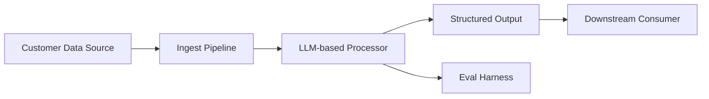

# [Engagement Name] — Pilot Proposal

**Document version**: v1.0
**Date**: [YYYY-MM-DD]
**Prepared by**: [FDE name]
**Approvers (required for sign-off)**:
- Exec sponsor: [name]
- Project owner: [name]
- Technical lead: [name]
- Security contact (if data sensitivity warrants): [name]

---

## 1. Problem Statement

[1-2 paragraphs. Customer's words as much as possible. The problem being solved, who it affects, and why now. Referenceable by someone who wasn't in discovery.]

## 2. Pilot Deliverable (One Sentence)

[ONE sentence. The thing the customer will be able to use at end of pilot. Must be specific enough that success can be judged.]

Example formulations:

- "A web service deployed to customer's staging environment that accepts a contract PDF and returns a structured risk summary with confidence scores, evaluated against 50 gold-set contracts."
- "A scheduled job running in customer's data warehouse that enriches new customer-support tickets with predicted category and suggested response draft, evaluated on 200 tickets from the past month."
- "A Snowflake Native App installable in customer's account that surfaces predicted churn score for each customer, evaluated on 90-day holdout data."

## 3. Success Criteria (Measurable)

Primary success criterion:

- **Metric**: [specific measurable metric]
- **Target**: [specific threshold]
- **Dataset**: [specific labeled evaluation set]
- **Reviewer**: [who signs off on the measurement]

Example:
- Metric: sensitivity at specificity ≥ 0.90 on flagged risk clauses.
- Target: sensitivity ≥ 0.80.
- Dataset: 50 gold-set contracts labeled by customer's legal team in weeks 1-2.
- Reviewer: [VP Legal / Legal Operations Lead].

Secondary criteria (nice-to-have):

- [criterion with target]
- [criterion with target]

## 4. Failure Criteria (Explicit Stop Conditions)

A midpoint evaluation at week 3 with the following result **pauses** the pilot for re-scoping:

- Primary metric below [threshold below success target].

At that point, 2-day re-scoping conversation determines: extend pilot, pivot scope, or conclude.

## 5. Scope Exclusions

Explicit list of what is NOT in the pilot:

- [ ] Production deployment (pilot is staging only)
- [ ] Integration with production auth/identity provider
- [ ] Multi-language support (English only)
- [ ] Mobile UI
- [ ] Historical data backfill
- [ ] Migration from the existing system
- [ ] [Customer-specific exclusions]

Post-pilot scope items that might be addressed in a follow-on engagement:

- [ ] [deferred feature 1]
- [ ] [deferred feature 2]

## 6. Timeline

6-week pilot. Weekly rhythm with Friday written status and daily 30-min syncs.

| Week | Focus | Deliverable at week end |
|------|-------|-------------------------|
| 1 | Data pipeline + eval harness | Running harness on 10 sample inputs |
| 2 | Iteration + midpoint eval | 20-sample midpoint evaluation |
| 3 | Architecture + staging deploy | System in staging, processing inputs end-to-end |
| 4 | Integration + soak test | 100-input soak completed |
| 5 | Final evaluation + polish | Final 50-sample evaluation run |
| 6 | Handover prep + exit review | Exit decision meeting held |

## 7. Resource Commitments

### Customer commits:

| Role | Time | Period |
|------|------|--------|
| Technical lead | 50% FTE | Weeks 1-6 |
| Data engineer | 20% FTE | Weeks 1-2 |
| Subject matter expert | 4 hours/week | Weeks 1-5 (gold-set labeling + review) |
| Project owner | 2 hours/week | Weeks 1-6 (status + steering) |
| Security contact | Available within 48h | Weeks 1-6 (blocking questions) |
| Exec sponsor | 30 min bi-weekly | Weeks 1-6 (business review) |

### Vendor commits (you + your team):

| Role | Time | Period |
|------|------|--------|
| FDE (primary) | 100% FTE | Weeks 1-6 |
| Product / DevRel support | Async, 24h response | Weeks 1-6 |
| Engineering escalation | On escalation only | Weeks 1-6 |

## 8. Architecture Overview

[Mermaid diagram of proposed system]



[1 paragraph describing the architecture decisions and key trade-offs.]

## 9. Risk Register

| # | Risk | Impact | Likelihood | Mitigation | Owner |
|---|------|--------|-----------|-----------|-------|
| 1 | Data format drift across prod sources | High | Medium | Validate 3 batches of samples in week 1 | FDE + Customer DE |
| 2 | Customer technical lead availability | High | Medium | Backup technical contact agreed upfront | Project owner |
| 3 | Success metric proves too aggressive | High | Medium | Midpoint eval catches this by week 3 | FDE + SME |
| 4 | Security requirements discovered late | Medium | Medium | Security contact reviews architecture doc in week 1 | Security + FDE |
| 5 | Cost at production scale exceeds budget | Medium | Low | Cost-per-call tracked from day 1; extrapolated in week 2 | FDE |

Add customer-specific risks here.

## 10. Exit Criteria and Next Steps

At end of week 6, an exit review meeting determines:

- **Proceed to production rollout**: if primary success criterion is met. Production rollout is a separate scope document.
- **Extend pilot 2 weeks**: if within 10% of success threshold and a clear remediation path exists.
- **Pivot scope**: if learning suggests a different approach. New scope document.
- **Conclude without production**: if success criterion not met and no clear path forward.

Each decision has a named criterion (not a feeling).

## 11. Communication Plan

- **Daily sync (30 min)**: FDE + technical lead, same time every day.
- **Weekly status email (Friday)**: to project owner, exec sponsor, technical lead.
- **Bi-weekly exec review (30 min)**: to exec sponsor.
- **Written artifacts**: in [shared workspace path].

## 12. Cost Estimate

Pilot cost (vendor side): [covered by engagement contract; ~$X for 6 weeks FDE].

Pilot cost (infrastructure): [cloud resources + LLM API calls; ~$Y].

Production scale estimate (for budget planning): [$Z/month at expected usage, derived from week 2 measurements].

## 13. Sign-off

By signing below, the approvers agree:

- The pilot deliverable is scoped to solve [the stated problem].
- The resource commitments are feasible and allocated.
- The success criteria are measurable and representative.
- The failure criteria trigger a re-scoping discussion, not a silent continuation.
- At end of week 6, an explicit decision about next steps is made.

```
Exec sponsor:    [name]        Date: ______ Signature: ______________
Project owner:   [name]        Date: ______ Signature: ______________
Technical lead:  [name]        Date: ______ Signature: ______________
Security:        [name]        Date: ______ Signature: ______________
FDE (vendor):    [your name]   Date: ______ Signature: ______________
```

---

## Appendix A: Definitions

- **Pilot**: time-boxed (6 weeks), scoped deliverable intended to validate feasibility before production commitment.
- **Gold set**: customer-labeled evaluation data used as ground truth for success measurement.
- **Staging**: customer's non-production environment with production-like infrastructure but no real-user traffic.

## Appendix B: Assumptions Embedded in This Scope

- Customer will provide access to sample data within 10 days of sign-off.
- Customer's staging environment is ready or ready-enough to deploy to within 3 weeks.
- LLM provider pricing remains within ±30% of current published rates.
- Customer's gold-set labels represent the production distribution within reasonable tolerance.

If any assumption is materially wrong, re-scoping is triggered.
